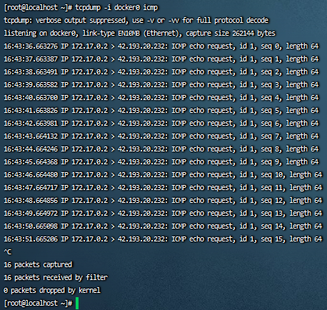

# 解决Docker容器内无法访问外网问题

> tips: 由于环境不同，问题的解决方法也自然不同，下面是小编所在环境的解决方式 `^_^`

#### 法一：重建网络`docker0`

```shell
sudo service docker stop
sudo pkill docker
sudo iptables -t nat -F
sudo ifconfig docker0 down
sudo brctl delbr docker0
sudo service docker start
```

#### 法二：开启宿主机的ipv4转发功能

> 针对解决`WARNING: IPv4 forwarding is disabled. Networking will not work.`

```shell
# 修改配置
echo "net.ipv4.ip_forward=1" >> /etc/sysctl.conf

# 重启network
systemctl restart network

# 查看 (0->标识未开启 1->标识开启)
sysctl net.ipv4.ip_forward
# net.ipv4.ip_forward = 1

# 重启docker
systemctl restart docker
```

#### 法三：使用`--net=host`宿主机网络方式启动容器

```shell
# 示例
docker run --net=host --name ubuntu_bash -i -t ubuntu:latest /bin/bash

docker run --net=host --rm alpine ping -c 5 baidu.com
```

#### 法四：关闭SELinux

```shell
# 查看SELinux状态
getenforce

# 临时关闭SELinux
setenforce 0

# 永久关闭SELinux
vim /etc/selinux/config
# 将 `SELINUX=enforcing` 改成 `SELINUX=disabled`

# 重启liunx
reboot
```

#### 法五

> 参考 https://github.com/coolsnowwolf/lede/issues/1760

```shell
# 修改配置
echo "net.bridge.bridge-nf-call-ip6tables = 1" >> /etc/sysctl.conf
echo "net.bridge.bridge-nf-call-iptables = 1" >> /etc/sysctl.conf
echo "net.bridge.bridge-nf-call-arptables = 1" >> /etc/sysctl.conf

# Luci > 网络 > 防火墙 > 转发：接受
# Luci > 状态 > 防火墙 > 重启防火墙

service docker restart
```

#### 法六

```shell
rm -rf /var/lib/docker/network/*

systemctl restart docker
```

#### 法七：修改DNS客户端解析文件`resolv.conf`

```shell
# 写入Liunx的DNS客户端解析文件resolv.conf里
#                 114.114.114.114 => 国内移动、电信和联通通用的DNS
#                 8.8.8.8 => google提供，更适合国外以及访问国外网站的用户使用
# echo nameserver 8.8.8.8 > /etc/resolv.conf
echo nameserver 114.114.114.114 > /etc/resolv.conf

# 查看配置
cat /etc/resolv.conf

# 测试
docker run --rm alpine ping -c 5 baidu.com
```

#### 法八：和网络工程师沟通下是否做了一定限制

```shell
# 先运行一个访问外网的程序
docker run --rm alpine ping -c 50 baidu.com

# 安装tcpdump
yum install tcpdump
# 利用tcpdump进行抓包分析
tcpdump -i docker0 icmp
# 发现有request包，表明本机到baidu的包，baidu是接收到的，可能是百度没响应（可能性不大）或者被公司防火墙阻断了
```



#### 法九：宿主机防火墙开启伪装IP功能

> tips: 感觉无用，小编直接关防火墙也没解决网络问题

```shell
# 查看防火墙状态
firewall-cmd --state
# 查看防火墙是否开启ip地址转发（ip地址伪装）
firewall-cmd --query-masquerade
# 开启ip地址转发
firewall-cmd --add-masquerade --permanent
# 将网络接口 docker0 加入 trusted zone，解决 DNS 问题
firewall-cmd --permanent --zone=trusted --add-interface=docker0
# 更新防火墙规则
firewall-cmd --reload
```

#### 法十：重装docker

> 此方式乃是最后无奈之举了...

---

#### 临时测试容器内能够ping

```shell
docker run --rm alpine ping -c 5 baidu.com
```

#### 小编个人问题记录 -- 未解决

基于`电信网`环境，在局域网window上安装centos7.6系统，宿主机能正常访问外网，但容器内不行，且容器内dns解析有问题；
如果直接访问ip的话，`tcpdump`抓包`docker0`发现只有请求，无任何响应。

临时使用`--net=host`方式解决外网访问问题，还待持续研究!
