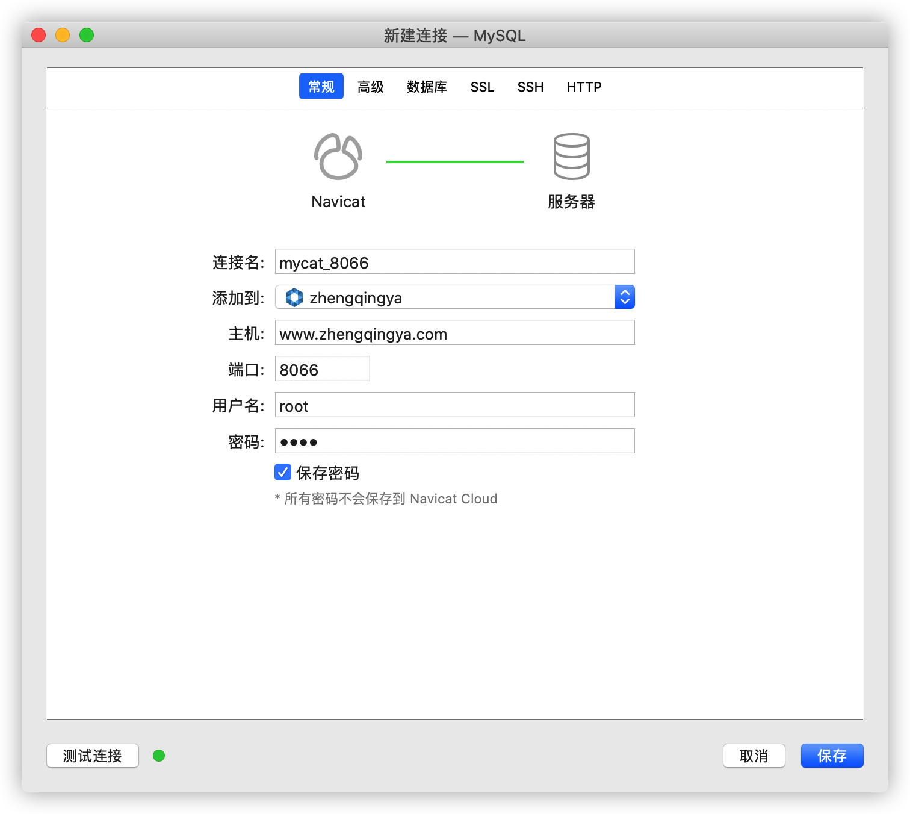
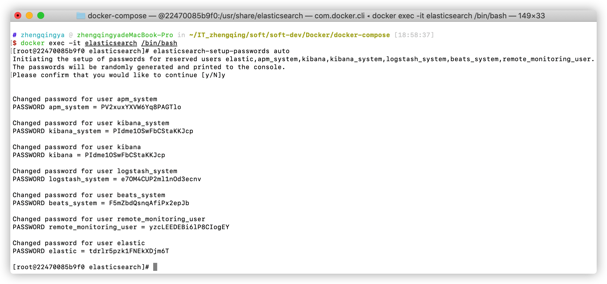
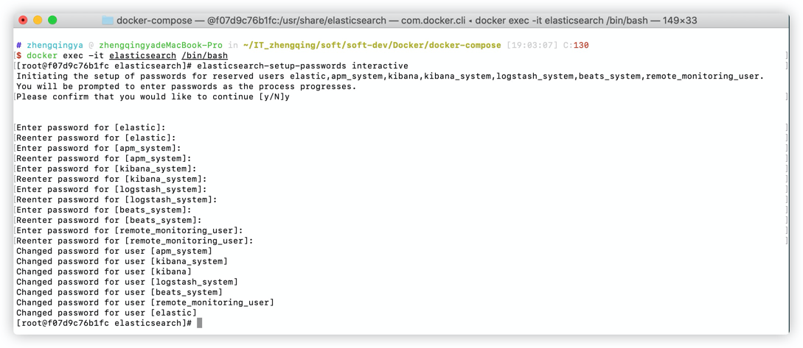
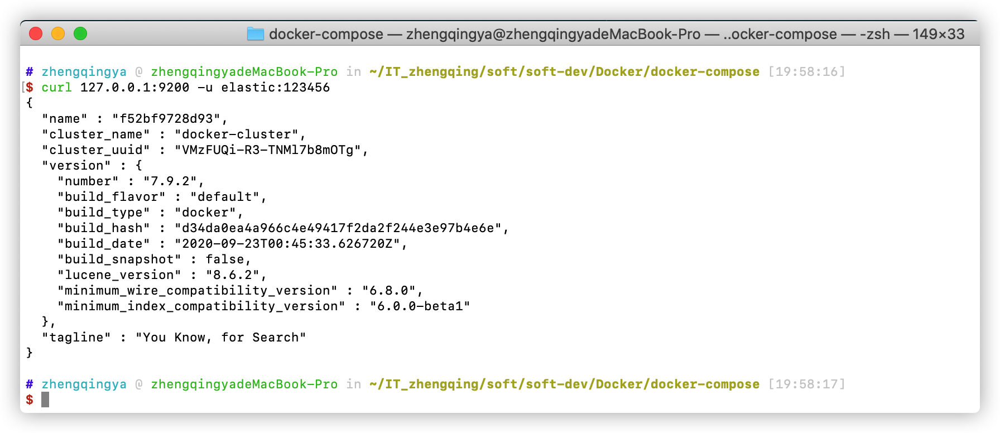
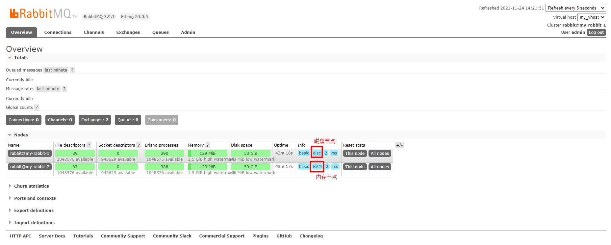

# docker-compose-liunx

通过docker-compose编排一系列环境进行一键快速部署运行，小白运维神器。


## 安装docker

```shell
# 通过yum源安装docker
sudo yum -y install docker
# 启动docker
sudo systemctl start docker
# 开机自启
sudo systemctl enable docker
```

## `docker-compose`安装

```shell
# 安装EPEL软件包
sudo yum -y install epel-release
# 安装pip3
sudo yum install -y python36-pip
# 升级
sudo pip3 install --upgrade pip
# 验证pip3版本
pip3 --version
# docker-compose安装
sudo pip3 install -U docker-compose
# 验证docker-compose版本
docker-compose --version
# 安装补全插件
# curl -L https://raw.githubusercontent.com/docker/compose/1.25.0/contrib/completion/bash/docker-compose > /etc/bash_completion.d/docker-compose
```

## `docker-compose`卸载

```shell
pip3 uninstall docker-compose
```

## `docker-compose`相关命令

```shell
# 构建镜像
docker-compose build
# 构建镜像，--no-cache表示不用缓存，否则在重新编辑Dockerfile后再build可能会直接使用缓存而导致新编辑内容不生效
docker-compose build --no-cache
# config 校验文件格式是否正确
docker-compose -f docker-compose.yml config
# 运行服务
ocker-compose up -d
# 启动/停止服务
docker-compose start/stop 服务名
# 停止服务
docker-compose down
# 查看容器日志
docker logs -f 容器ID
# 查看镜像
docker-compose images
# 拉取镜像
docker-compose pull 镜像名
```

## 常用shell组合

```shell
# 删除所有容器
docker stop `docker ps -q -a` | xargs docker rm
# 删除所有标签为none的镜像
docker images|grep \<none\>|awk '{print $3}'|xargs docker rmi
# 查找容器IP地址
docker inspect 容器名或ID | grep "IPAddress"
# 创建网段, 名称: mynet, 分配两个容器在同一网段中 (这样子才可以互相通信)
docker network create mynet
docker run -d --net mynet --name container1 my_image
docker run -it --net mynet --name container1 another_image
```

---

## 环境准备

```shell
# 安装git命令： yum install -y git
git clone https://gitee.com/zhengqingya/docker-compose.git
cd docker-compose/Liunx
```

====================================================================================\
========================= ↓↓↓↓↓↓ 环境部署 start ↓↓↓↓↓↓ ====================================\
====================================================================================\

## 运行服务

### Portainer

```shell
docker-compose -f docker-compose-portainer.yml -p portainer up -d

-p：项目名称
-f：指定docker-compose.yml文件路径
-d：后台启动
```

访问地址：[`ip地址:9000`](www.zhengqingya.com:9000)

### MySQL

```shell
# 5.7
docker-compose -f docker-compose-mysql5.7.yml -p mysql5.7 up -d
# 8.0
docker-compose -f docker-compose-mysql8.0.yml -p mysql8.0 up -d
```

### MySQL - 主从同步

```shell
docker-compose -f docker-compose-mysql-master-slave.yml -p mysql-master-slave up -d
```

```shell
# ================== ↓↓↓↓↓↓ 配置主库 ↓↓↓↓↓↓ ==================
# 进入主库
docker exec -it mysql_master /bin/bash
# 登录mysql
mysql -uroot -proot
#  创建用户slave，密码123456
CREATE USER 'slave'@'%' IDENTIFIED BY '123456';
# 授予slave用户 `REPLICATION SLAVE`权限和`REPLICATION CLIENT`权限，用于在`主` `从` 数据库之间同步数据
GRANT REPLICATION SLAVE, REPLICATION CLIENT ON *.* TO 'slave'@'%';
# 授予所有权限则执行命令: GRANT ALL PRIVILEGES ON *.* TO 'slave'@'%';
# 使操作生效
FLUSH PRIVILEGES;
# 查看状态
show master status;
# 注：File和Position字段的值slave中将会用到，在slave操作完成之前不要操作master，否则将会引起状态变化，即File和Position字段的值变化 !!!
# +------------------+----------+--------------+------------------+-------------------+
# | File             | Position | Binlog_Do_DB | Binlog_Ignore_DB | Executed_Gtid_Set |
# +------------------+----------+--------------+------------------+-------------------+
# | mysql-bin.000003 |      769 |              |                  |                   |
# +------------------+----------+--------------+------------------+-------------------+
# 1 row in set (0.00 sec)


# ================== ↓↓↓↓↓↓ 配置从库 ↓↓↓↓↓↓ ==================
# 进入从库
docker exec -it mysql_slave /bin/bash
# 登录mysql
mysql -uroot -proot
change master to master_host='www.zhengqingya.com',master_port=3306, master_user='slave', master_password='123456', master_log_file='mysql-bin.000003', master_log_pos= 769, master_connect_retry=30;
# 开启主从同步过程  【停止命令：stop slave;】
start slave;
# 查看主从同步状态
show slave status \G
# Slave_IO_Running 和 Slave_SQL_Running 都是Yes的话，就说明主从同步已经配置好了！
# 如果Slave_IO_Running为Connecting，SlaveSQLRunning为Yes，则说明配置有问题，这时候就要检查配置中哪一步出现问题了哦，可根据Last_IO_Error字段信息排错或谷歌…
# *************************** 1. row ***************************
#                Slave_IO_State: Waiting for master to send event
#                   Master_Host: www.zhengqingya.com
#                   Master_User: slave
#                   Master_Port: 3306
#                 Connect_Retry: 30
#               Master_Log_File: mysql-bin.000003
#           Read_Master_Log_Pos: 769
#                Relay_Log_File: c598d8402b43-relay-bin.000002
#                 Relay_Log_Pos: 320
#         Relay_Master_Log_File: mysql-bin.000003
#              Slave_IO_Running: Yes
#             Slave_SQL_Running: Yes
#               Replicate_Do_DB:
```

###### 解决主从同步数据不一致问题

```shell
# 注意：操作的时候停止主库数据写入

# 在从库查看主从同步状态
docker exec -it mysql_slave /bin/bash
mysql -uroot -proot
show slave status \G
#              Slave_IO_Running: Yes
#             Slave_SQL_Running: No

# 1、手动同步主从库数据
# 先在从库停止主从同步
stop slave;
# 导出主库数据
mysqldump -h www.zhengqingya.com -P 3306 -uroot -proot --all-databases > /tmp/all.sql
# 导入到从库
mysql -uroot -proot
source /tmp/all.sql;

# 2、开启主从同步
# 查看主库状态 => 拿到File和Position字段的值
docker exec -it mysql_master /bin/bash
mysql -uroot -proot
show master status;
# 从库操作
change master to master_host='www.zhengqingya.com',master_port=3306, master_user='slave', master_password='123456', master_log_file='mysql-bin.000004', master_log_pos= 488117, master_connect_retry=30;
start slave;
# 查看主从同步状态
show slave status \G
#              Slave_IO_Running: Yes
#             Slave_SQL_Running: Yes
```

### Mycat

> Java语言编写的MySQL数据库网络协议的开源中间件
> 部署可参考 https://zhengqing.blog.csdn.net/article/details/104700437

```shell
docker-compose -f docker-compose-mycat.yml -p mycat up -d
```

Navicat可视化工具连接参数

> mysql -hwww.zhengqingya.com -P8066 -uroot -proot

| 名称           | 值                  |
| -------------- | ------------------- |
| 连接名         | mycat_8066          |
| 主机名或IP地址 | www.zhengqingya.com |
| 端口           | 8066                |
| 用户名         | root                |
| 密码           | root                |



### Mycat-web

> Mycat可视化运维的管理和监控平台

```shell
docker-compose -f docker-compose-mycat-web.yml -p mycat-web up -d
```

访问地址：[`ip地址:8082/mycat`](www.zhengqingya.com:8082/mycat)

### Yearning

```shell
docker-compose -f docker-compose-yearning.yml -p yearning up -d
```

访问地址：[`ip地址:8000`](www.zhengqingya.com:8000)
默认登录账号密码：`admin/Yearning_admin`

### Oracle18c

```shell
docker-compose -f docker-compose-oracle18c.yml -p oracle18c up -d
```

> 配置参考：[Docker(9) 安装Oracle18c](https://zhengqing.blog.csdn.net/article/details/103296040)

### Couchbase

```shell
docker-compose -f docker-compose-couchbase.yml -p couchbase up -d
```

管理平台地址：[`ip地址:8091`](www.zhengqingya.com:8091)
默认登录账号密码：`Administrator/password`

### Redis

```shell
# 当前目录下所有文件赋予权限(读、写、执行)
chmod -R 777 ./redis
# 运行
docker-compose -f docker-compose-redis.yml -p redis up -d
```

连接redis

```shell
docker exec -it redis redis-cli -a 123456  # 密码为123456
```

### Jrebel

```shell
docker-compose -f docker-compose-jrebel.yml -p jrebel up -d
```

默认反代`idea.lanyus.com`, 运行起来后

1. 激活地址： `ip地址:8888/UUID` -> 注：UUID可以自己生成，并且必须是UUID才能通过验证 -> [UUID在线生成](http://www.uuid.online/)
2. 邮箱随意填写

### Nginx

```shell
docker-compose -f docker-compose-nginx.yml -p nginx up -d
```

访问地址：[`ip地址:80`](www.zhengqingya.com:80)

### Elasticsearch

```shell
# 当前目录下所有文件赋予权限(读、写、执行)
chmod -R 777 ./elasticsearch
# 运行
docker-compose -f docker-compose-elasticsearch.yml -p elasticsearch up -d
# 运行后，再次给新创建的文件赋予权限
chmod -R 777 ./elasticsearch
```

1. ES访问地址：[`ip地址:9200`](www.zhengqingya.com:9200)
   默认账号密码：`elastic/123456`
2. kibana访问地址：[`ip地址:5601/app/dev_tools#/console`](www.zhengqingya.com:5601/app/dev_tools#/console)
   默认账号密码：`elastic/123456`

#### 设置ES密码

```shell
# 进入容器
docker exec -it elasticsearch /bin/bash
# 设置密码-随机生成密码
# elasticsearch-setup-passwords auto
# 设置密码-手动设置密码
elasticsearch-setup-passwords interactive
# 访问
curl 127.0.0.1:9200 -u elastic:123456
```





#### 修改ES密码

```shell
# 修改elastic密码为123456 (注：执行命令时会让认证之前账号密码)
curl -H "Content-Type:application/json" -XPOST -u elastic 'http://127.0.0.1:9200/_xpack/security/user/elastic/_password' -d '{ "password" : "123456" }'
```

### ELK

```shell
# 当前目录下所有文件赋予权限(读、写、执行)
chmod -R 777 ./elk
# 运行
docker-compose -f docker-compose-elk.yml -p elk up -d
# 若运行之后启动日志再次报相关权限问题，再次给新产生的文件赋予权限
chmod -R 777 ./elk
```

1. ES访问地址：[`ip地址:9200`](www.zhengqingya.com:9200)
   默认账号密码：`elastic/123456`
2. kibana访问地址：[`ip地址:5601`](www.zhengqingya.com:5601)
   默认账号密码：`elastic/123456`
   
#### 设置ES密码

```shell
# 进入容器
docker exec -it elasticsearch /bin/bash
# 设置密码-随机生成密码
# elasticsearch-setup-passwords auto
# 设置密码-手动设置密码
elasticsearch-setup-passwords interactive
```


### Filebeat

> 轻量型日志采集器，可以将指定日志转发到Logstash、Elasticsearch、Kafka、Redis等中。

```shell
docker-compose -f docker-compose-filebeat.yml -p filebeat up -d
```

### RabbitMQ

```shell
# 当前目录下所有文件赋予权限(读、写、执行)
chmod -R 777 ./rabbitmq
# 运行 [ 注：如果之前有安装过，需要清除浏览器缓存和删除rabbitmq相关的存储数据(如:这里映射到宿主机的data数据目录)，再重装，否则会出现一定问题！ ]
docker-compose -f docker-compose-rabbitmq.yml -p rabbitmq up -d

# 运行3.7.8-management版本
# docker-compose -f docker-compose-rabbitmq-3.7.8-management.yml -p rabbitmq up -d

# 进入容器
docker exec -it rabbitmq /bin/bash
# 启用延时插件
rabbitmq-plugins enable rabbitmq_delayed_message_exchange
# 查看已安装插件
rabbitmq-plugins list
```

web管理端：[`ip地址:15672`](www.zhengqingya.com:15672)
登录账号密码：`admin/admin`

### RabbitMQ - 集群

```shell
# 当前目录下所有文件赋予权限(读、写、执行)
chmod -R 777 ./rabbitmq-cluster
# 设置Erlang Cookie文件权限(cookie文件必须只允许拥有者有权操作)
chmod 600 ./rabbitmq-cluster/.erlang.cookie
# 运行 [ 注：如果之前有安装过，需要清除浏览器缓存和删除rabbitmq相关的存储数据(如:这里映射到宿主机的data数据目录)，再重装，否则会出现一定问题！ ]
docker-compose -f docker-compose-rabbitmq-cluster.yml -p rabbitmq-cluster up -d

# 启用延迟插件(注：如果节点类型为内存节点，则无法启用延迟插件)
docker exec rabbitmq-1 /bin/bash -c 'rabbitmq-plugins enable rabbitmq_delayed_message_exchange'
docker exec rabbitmq-2 /bin/bash -c 'rabbitmq-plugins enable rabbitmq_delayed_message_exchange'

# 执行脚本 => 配置集群
sh ./rabbitmq-cluster/init-rabbitmq.sh

# 配置镜像队列(允许内建双活冗余选项，与普通队列不同，镜像节点在集群中的其他节点拥有从队列拷贝，一旦主节点不可用，最老的从队列将被选举为新的主队列)
docker exec -it rabbitmq-1 /bin/bash
rabbitmqctl set_policy -p my_vhost ha-all "^" '{"ha-mode":"all"}' --apply-to all
# 查看镜像队列`ha-all`
rabbitmqctl list_policies -p my_vhost
# 删除镜像队列`ha-all`
rabbitmqctl clear_policy -p my_vhost ha-all
```

web管理端：[`ip地址:15672`](www.zhengqingya.com:15672)
登录账号密码：`admin/admin`



### ActiveMQ

```shell
docker-compose -f docker-compose-activemq.yml -p activemq up -d
```

访问地址：[`ip地址:8161`](www.zhengqingya.com:8161)
登录账号密码：`admin/admin`

### BaiduPCS-Web

```shell
docker-compose -f docker-compose-baidupcs-web.yml -p baidupcs-web up -d
```

访问地址：[`ip地址:5299`](www.zhengqingya.com:5299)

### MinIO

```shell
docker-compose -f docker-compose-minio.yml -p minio up -d
```

访问地址：[`ip地址:9000/minio`](www.zhengqingya.com:9000/minio)
登录账号密码：`root/password`

### Nacos

```shell
# 注：需要修改docker-compose-nacos-mysql.yml 中相关数据库连接信息和JVM参数相关信息
docker-compose -f docker-compose-nacos.yml -p nacos up -d

# mysql数据库版 【 需自己建库`nacos_config`, 并执行`/Liunx/nacos_mysql/nacos-mysql.sql`脚本 】
# nacos1.4.1版本
docker-compose -f docker-compose-nacos-mysql.yml -p nacos up -d
# nacos2.0.3版本
docker-compose -f docker-compose-nacos-mysql-2.0.3.yml -p nacos_v2.0.3 up -d
```

访问地址：[`ip地址:8848/nacos`](www.zhengqingya.com:8848/nacos)
登录账号密码默认：`nacos/nacos`

> 注：`docker-compose-nacos-mysql.yml`已开启连接密码安全认证，在java连接时需新增配置如下

```yml
spring:
  cloud:
    nacos:
      discovery:
        username: nacos
        password: nacos
      config:
        username: ${spring.cloud.nacos.discovery.username}
        password: ${spring.cloud.nacos.discovery.password}
```

### Sentinel

```shell
# 普通版
docker-compose -f docker-compose-sentinel.yml -p sentinel up -d
# 持久化配置到mysql版
# docker-compose -f docker-compose-sentinel-mysql.yml -p sentinel up -d
```

访问地址：[`ip地址:8858`](www.zhengqingya.com:8858)
登录账号密码：`sentinel/sentinel`

### Kafka

```shell
docker-compose -f docker-compose-kafka.yml -p kafka up -d
```

集群管理地址：[`ip地址:9000`](www.zhengqingya.com:9000)

### Tomcat

```shell
docker-compose -f docker-compose-tomcat.yml -p tomcat up -d
```

访问地址：[`ip地址:8081`](www.zhengqingya.com:8081)

### GitLab

```shell
docker-compose -f docker-compose-gitlab.yml -p gitlab up -d
```

访问地址：[`ip地址:10080`](www.zhengqingya.com:10080)
默认root账号，密码访问页面时需自己设置

### Jenkins

```shell
docker-compose -f docker-compose-jenkins.yml -p jenkins up -d
```

访问地址：[`ip地址:8080`](www.zhengqingya.com:8080)

### Nextcloud - 多端同步网盘

```shell
docker-compose -f docker-compose-nextcloud.yml -p nextcloud up -d
```

访问地址：[`ip地址:81`](www.zhengqingya.com:81) , 创建管理员账号

### Walle - 支持多用户多语言部署平台

```shell
docker-compose -f docker-compose-walle.yml -p walle up -d && docker-compose -f docker-compose-walle.yml logs -f
```

访问地址：[`ip地址:80`](www.zhengqingya.com:80)
初始登录账号如下：

```
超管：super@walle-web.io \ Walle123
所有者：owner@walle-web.io \ Walle123
负责人：master@walle-web.io \ Walle123
开发者：developer@walle-web.io \ Walle123
访客：reporter@walle-web.io \ Walle123
```

### Grafana - 开源数据可视化工具(数据监控、数据统计、警报)

```shell
docker-compose -f docker-compose-grafana.yml -p grafana up -d
```

访问地址：[`http://ip地址:3000`](www.zhengqingya.com:3000)
默认登录账号密码：`admin/admin`

### Grafana Loki - 一个水平可扩展，高可用性，多租户的日志聚合系统

```shell
# 先授权，否则会报错：`cannot create directory '/var/lib/grafana/plugins': Permission denied`
chmod 777 $PWD/grafana_promtail_loki/grafana/data
chmod 777 $PWD/grafana_promtail_loki/grafana/log

# 运行
docker-compose -f docker-compose-grafana-promtail-loki.yml -p grafana_promtail_loki up -d
```

访问地址：[`http://ip地址:3000`](www.zhengqingya.com:3000)
默认登录账号密码：`admin/admin`

### Graylog - 日志管理工具

```shell
docker-compose -f docker-compose-graylog.yml -p graylog_demo up -d
```

访问地址：[`http://ip地址:9001`](www.zhengqingya.com:9001)
默认登录账号密码：`admin/admin`

### FastDFS - 分布式文件系统

```shell
docker-compose -f docker-compose-fastdfs.yml -p fastdfs up -d
```

###### 测试

```shell
# 等待出现如下日志信息：
# [2020-07-24 09:11:43] INFO - file: tracker_client_thread.c, line: 310, successfully connect to tracker server 39.106.45.72:22122, as a tracker client, my ip is 172.16.9.76

# 进入storage容器
docker exec -it fastdfs_storage /bin/bash
# 进入`/var/fdfs`目录
cd /var/fdfs
# 执行如下命令,会返回在storage存储文件的路径信息,然后拼接上ip地址即可测试访问
/usr/bin/fdfs_upload_file /etc/fdfs/client.conf test.jpg
# ex:
http://www.zhengqingya.com:8888/group1/M00/00/00/rBEAAl8aYsuABe4wAAhfG6Hv0Jw357.jpg
```

### YApi - 高效、易用、功能强大的api管理平台

```shell
docker-compose -f docker-compose-yapi.yml -p yapi up -d
```

如下运行成功：

```shell
 log: mongodb load success...
 初始化管理员账号成功,账号名："admin@admin.com"，密码："ymfe.org"
部署成功，请切换到部署目录，输入： "node vendors/server/app.js" 指令启动服务器, 然后在浏览器打开 http://127.0.0.1:3000 访问
log: -------------------------------------swaggerSyncUtils constructor-----------------------------------------------
log: 服务已启动，请打开下面链接访问: 
http://127.0.0.1:3000/
log: mongodb load success...
```

访问地址：[`http://ip地址:3000`](www.zhengqingya.com:3000)
默认登录账号密码：`admin@admin.com/ymfe.org`

### RocketMQ

> 注：修改 `xx/rocketmq/rocketmq_broker/conf/broker.conf`中配置`brokerIP1`为`宿主机IP`

```shell
docker-compose -f docker-compose-rocketmq.yml -p rocketmq up -d
```

访问地址：[`http://ip地址:9002`](www.zhengqingya.com:9002)

### XXL-JOB - 分布式任务调度平台

```shell
docker-compose -f docker-compose-xxl-job.yml -p xxl-job up -d
```

访问地址：[`http://ip地址:9003/xxl-job-admin`](www.zhengqingya.com:9003/xxl-job-admin)
默认登录账号密码：`admin/123456`

### MongoDB - 基于文档的通用分布式数据库

```shell
docker-compose -f docker-compose-mongodb.yml -p mongodb up -d
```

访问地址：[`http://ip地址:1234`](www.zhengqingya.com:1234)
Connection string：`mongodb://admin:123456@ip地址:27017`

### Zookeeper

```shell
docker-compose -f docker-compose-zookeeper.yml -p zookeeper up -d
```

可视化界面访问地址：[`http://ip地址:9090`](www.zhengqingya.com:9090)

> 桌面可视化工具PrettyZoo: [https://github.com/vran-dev/PrettyZoo](https://github.com/vran-dev/PrettyZoo)

### Flowable - 业务流程引擎

```shell
docker-compose -f docker-compose-flowable.yml -p flowable up -d
```

可视化界面访问地址：[`http://ip地址:9004/flowable-ui`](www.zhengqingya.com:9004/flowable-ui)
默认登录账号密码：`admin/test`

### Prometheus - 监控系统和时间序列数据库

> 注：此为未完善版！
> `docker-compose-prometheus.yml` 需修改grafana中配置的mysql连接信息
> `prometheus.yml` 自行配置

```shell
docker-compose -f docker-compose-prometheus.yml -p prometheus up -d
```

1. grafana访问地址：[`http://ip地址:3000`](www.zhengqingya.com:3000)
   默认登录账号密码：`admin/admin`
2. prometheus访问地址: [`http://ip地址:9090`](www.zhengqingya.com:9090)
3. exporter访问地址: [`http://ip地址:9100/metrics`](www.zhengqingya.com:9100/metrics)


#### 其它

1. grafana面板资源 https://grafana.com/grafana/dashboards

### Zipkin - 分布式追踪系统

> 它有助于收集对服务架构中的延迟问题进行故障排除所需的计时数据。功能包括收集和查找这些数据。
> 注：记得创建相应zipkin库和表

```shell
docker-compose -f docker-compose-zipkin.yml -p zipkin up -d
```

启动成功日志如下：

```
                  oo
                 oooo
                oooooo
               oooooooo
              oooooooooo
             oooooooooooo
           ooooooo  ooooooo
          oooooo     ooooooo
         oooooo       ooooooo
        oooooo   o  o   oooooo
       oooooo   oo  oo   oooooo
     ooooooo  oooo  oooo  ooooooo
    oooooo   ooooo  ooooo  ooooooo
   oooooo   oooooo  oooooo  ooooooo
  oooooooo      oo  oo      oooooooo
  ooooooooooooo oo  oo ooooooooooooo
      oooooooooooo  oooooooooooo
          oooooooo  oooooooo
              oooo  oooo
     ________ ____  _  _____ _   _
    |__  /_ _|  _ \| |/ /_ _| \ | |
      / / | || |_) | ' / | ||  \| |
     / /_ | ||  __/| . \ | || |\  |
    |____|___|_|   |_|\_\___|_| \_|
:: version 2.23.2 :: commit 7bf3aab ::
2021-08-30 16:33:27.414  INFO [/] 1 --- [oss-http-*:9411] c.l.a.s.Server                           : Serving HTTP at /[0:0:0:0:0:0:0:0%0]:9411 - http://127.0.0.1:9411/
```

可视化界面访问地址：[`http://ip地址:9411/zipkin`](www.zhengqingya.com:9411/zipkin)


### Rancher - 开源容器管理平台

```shell
docker-compose -f docker-compose-rancher.yml -p rancher up -d
```

访问地址：[`http://ip地址:80`](www.zhengqingya.com:80)

### Seata - 分布式事务

> 1. config.txt => https://github.com/seata/seata/blob/develop/script/config-center/config.txt
> 2. nacos-config.sh => https://github.com/seata/seata/blob/develop/script/config-center/nacos/nacos-config.sh
> 3. seata.sql => https://github.com/seata/seata/blob/develop/script/server/db/mysql.sql

```shell
# 运行
docker-compose -f docker-compose-seata.yml -p seata up -d
# 查看日志
docker exec -it seata_server sh
```

### SonarQube

一款静态代码质量分析工具，支持Java、Python、PHP、JavaScript、CSS等25种以上的语言，而且能够集成在IDE、Jenkins、Git等服务中，方便随时查看代码质量分析报告。

```shell
docker-compose -f docker-compose-sonarqube.yml -p sonarqube up -d
# mysql配置版
# docker-compose -f docker-compose-sonarqube6.7.1.yml -p sonarqube up -d
```

访问地址：[`http://ip地址:9005`](www.zhengqingya.com:9005)
默认登录账号密码：`admin/admin`


### canal

阿里巴巴 MySQL binlog 增量订阅&消费组件

```shell
# tips: 先修改映射到宿主机的相关配置文件信息

# 导入初始化SQL
Liunx/canal/canal_admin/canal_manager.sql

# 运行
docker-compose -f docker-compose-canal.yml -p canal up -d
```

访问地址：[`http://ip地址:8089`](www.zhengqingya.com:8089)
默认登录账号密码：`admin/123456`

==============================================================================\
======================== ↑↑↑↑↑↑ 环境部署 end ↑↑↑↑↑↑ ================================\
==============================================================================\
