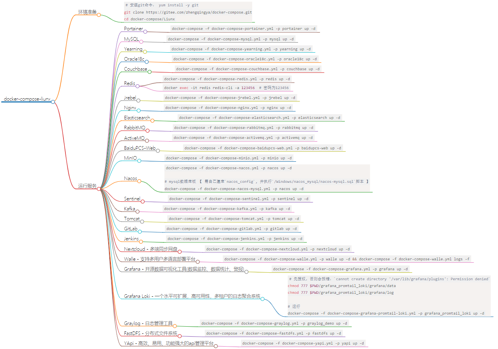

# docker-compose-liunx



## 安装docker

```shell
# 通过yum源安装docker
sudo yum -y install docker
# 启动docker
sudo systemctl start docker
# 开机自启
sudo systemctl enable docker
```

## `docker-compose`安装

```shell
# 如果有pip则直接执行此命令即可: sudo pip install -U docker-compose

# 安装依赖
yum -y install epel-release
# 安装PIP
yum -y install python-pip
# 升级PIP
pip install --upgrade pip
# 验证pip 版本
pip --version
# 安装docker compose
pip install -U docker-compose==1.25.0
# 验证docker compose版本
docker-compose --version
# 安装补全插件
curl -L https://raw.githubusercontent.com/docker/compose/1.25.0/contrib/completion/bash/docker-compose > /etc/bash_completion.d/docker-compose
```

## `docker-compose`卸载

```shell
# pip卸载
pip uninstall docker-compose
```

## `docker-compose`相关命令

```shell
# 构建镜像
docker-compose build
# 构建镜像，--no-cache表示不用缓存，否则在重新编辑Dockerfile后再build可能会直接使用缓存而导致新编辑内容不生效
docker-compose build --no-cache
# config 校验文件格式是否正确
docker-compose -f docker-compose.yml config
# 运行服务
ocker-compose up -d
# 启动/停止服务
docker-compose start/stop 服务名
# 停止服务
docker-compose down
# 查看容器日志
docker logs -f 容器ID
# 查看镜像
docker-compose images
# 拉取镜像
docker-compose pull 镜像名
```

## 常用shell组合

```shell
# 删除所有容器
docker stop `docker ps -q -a` | xargs docker rm
# 删除所有标签为none的镜像
docker images|grep \<none\>|awk '{print $3}'|xargs docker rmi
# 查找容器IP地址
docker inspect 容器名或ID | grep "IPAddress"
# 创建网段, 名称: mynet, 分配两个容器在同一网段中 (这样子才可以互相通信)
docker network create mynet
docker run -d --net mynet --name container1 my_image
docker run -it --net mynet --name container1 another_image
```

---

## 环境准备

```shell
# 安装git命令： yum install -y git
git clone https://gitee.com/zhengqingya/docker-compose.git
cd docker-compose/Liunx
```

====================================================================================\
=========================  ↓↓↓↓↓↓ 环境部署 start ↓↓↓↓↓↓  ====================================\
====================================================================================\

## 运行服务

### Portainer

```shell
docker-compose -f docker-compose-portainer.yml -p portainer up -d

-p：项目名称
-f：指定docker-compose.yml文件路径
-d：后台启动
```

访问地址：[`ip地址:9000`](www.zhengqingya.com:9000)

### MySQL

```shell
docker-compose -f docker-compose-mysql.yml -p mysql up -d
```

### Yearning

```shell
docker-compose -f docker-compose-yearning.yml -p yearning up -d
```

访问地址：[`ip地址:8000`](www.zhengqingya.com:8000)
默认登录账号密码：`admin/Yearning_admin`

### Oracle18c

```shell
docker-compose -f docker-compose-oracle18c.yml -p oracle18c up -d
```

> 配置参考：[Docker(9) 安装Oracle18c](https://zhengqing.blog.csdn.net/article/details/103296040)

### Couchbase

```shell
docker-compose -f docker-compose-couchbase.yml -p couchbase up -d
```

管理平台地址：[`ip地址:8091`](www.zhengqingya.com:8091)
默认登录账号密码：`Administrator/password`

### Redis

```shell
docker-compose -f docker-compose-redis.yml -p redis up -d
```

连接redis

```shell
docker exec -it redis redis-cli -a 123456  # 密码为123456
```

### Jrebel

```shell
docker-compose -f docker-compose-jrebel.yml -p jrebel up -d
```

默认反代`idea.lanyus.com`, 运行起来后

1. 激活地址： `ip地址:8888/UUID` -> 注：UUID可以自己生成，并且必须是UUID才能通过验证 -> [UUID在线生成](http://www.uuid.online/)
2. 邮箱随意填写

### Nginx

```shell
docker-compose -f docker-compose-nginx.yml -p nginx up -d
```

访问地址：[`ip地址:80`](www.zhengqingya.com:80)

### Elasticsearch

```shell
docker-compose -f docker-compose-elasticsearch.yml -p elasticsearch up -d
```

### RabbitMQ

```shell
docker-compose -f docker-compose-rabbitmq.yml -p rabbitmq up -d
```

web管理端：[`ip地址:15672`](www.zhengqingya.com:15672)
登录账号密码：`admin/admin`

### ActiveMQ

```shell
docker-compose -f docker-compose-activemq.yml -p activemq up -d
```

访问地址：[`ip地址:8161`](www.zhengqingya.com:8161)
登录账号密码：`admin/admin`

### BaiduPCS-Web

```shell
docker-compose -f docker-compose-baidupcs-web.yml -p baidupcs-web up -d
```

访问地址：[`ip地址:5299`](www.zhengqingya.com:5299)

### MinIO

```shell
docker-compose -f docker-compose-minio.yml -p minio up -d
```

访问地址：[`ip地址:9000/minio`](www.zhengqingya.com:9000/minio)
登录账号密码：`root/password`

### Nacos

```shell
docker-compose -f docker-compose-nacos.yml -p nacos up -d

# mysql数据库版 【 需自己建库`nacos_config`, 并执行`/Windows/nacos_mysql/nacos-mysql.sql`脚本 】
docker-compose -f docker-compose-nacos-mysql.yml -p nacos up -d
```

访问地址：[`ip地址:8848/nacos`](www.zhengqingya.com:8848/nacos)
登录账号密码默认：`nacos/nacos`

> 注：`docker-compose-nacos-mysql.yml`已开启连接密码安全认证，在java连接时需新增配置如下

```yml
spring:
  cloud:
    nacos:
      discovery:
        username: nacos
        password: nacos
      config:
        username: ${spring.cloud.nacos.discovery.username}
        password: ${spring.cloud.nacos.discovery.password}
```

### Sentinel

```shell
docker-compose -f docker-compose-sentinel.yml -p sentinel up -d
```

访问地址：[`ip地址:8858`](www.zhengqingya.com:8858)
登录账号密码：`sentinel/sentinel`

### Kafka

```shell
docker-compose -f docker-compose-kafka.yml -p kafka up -d
```

集群管理地址：[`ip地址:9000`](www.zhengqingya.com:9000)

### Tomcat

```shell
docker-compose -f docker-compose-tomcat.yml -p tomcat up -d
```

访问地址：[`ip地址:8081`](www.zhengqingya.com:8081)

### GitLab

```shell
docker-compose -f docker-compose-gitlab.yml -p gitlab up -d
```

访问地址：[`ip地址:10080`](www.zhengqingya.com:10080)
默认root账号，密码访问页面时需自己设置

### Jenkins

```shell
docker-compose -f docker-compose-jenkins.yml -p jenkins up -d
```

访问地址：[`ip地址:8080`](www.zhengqingya.com:8080)

### Nextcloud - 多端同步网盘

```shell
docker-compose -f docker-compose-nextcloud.yml -p nextcloud up -d
```

访问地址：[`ip地址:81`](www.zhengqingya.com:81) , 创建管理员账号

### Walle - 支持多用户多语言部署平台

```shell
docker-compose -f docker-compose-walle.yml -p walle up -d && docker-compose -f docker-compose-walle.yml logs -f
```

访问地址：[`ip地址:80`](www.zhengqingya.com:80)
初始登录账号如下：
```
超管：super@walle-web.io \ Walle123
所有者：owner@walle-web.io \ Walle123
负责人：master@walle-web.io \ Walle123
开发者：developer@walle-web.io \ Walle123
访客：reporter@walle-web.io \ Walle123
```

### Grafana - 开源数据可视化工具(数据监控、数据统计、警报)

```shell
docker-compose -f docker-compose-grafana.yml -p grafana up -d
```

访问地址：[`http://ip地址:3000`](www.zhengqingya.com:3000)
默认登录账号密码：`admin/admin`

### Grafana Loki - 一个水平可扩展，高可用性，多租户的日志聚合系统

```shell
# 先授权，否则会报错：`cannot create directory '/var/lib/grafana/plugins': Permission denied`
chmod 777 $PWD/grafana_promtail_loki/grafana/data
chmod 777 $PWD/grafana_promtail_loki/grafana/log

# 运行
docker-compose -f docker-compose-grafana-promtail-loki.yml -p grafana_promtail_loki up -d
```

访问地址：[`http://ip地址:3000`](www.zhengqingya.com:3000)
默认登录账号密码：`admin/admin`

### Graylog - 日志管理工具

```shell
docker-compose -f docker-compose-graylog.yml -p graylog_demo up -d
```

访问地址：[`http://ip地址:9001`](www.zhengqingya.com:9001)
默认登录账号密码：`admin/admin`

### FastDFS - 分布式文件系统

```shell
docker-compose -f docker-compose-fastdfs.yml -p fastdfs up -d
```

###### 测试

```shell
# 等待出现如下日志信息：
# [2020-07-24 09:11:43] INFO - file: tracker_client_thread.c, line: 310, successfully connect to tracker server 39.106.45.72:22122, as a tracker client, my ip is 172.16.9.76

# 进入storage容器
docker exec -it fastdfs_storage /bin/bash
# 进入`/var/fdfs`目录
cd /var/fdfs
# 执行如下命令,会返回在storage存储文件的路径信息,然后拼接上ip地址即可测试访问
/usr/bin/fdfs_upload_file /etc/fdfs/client.conf test.jpg
# ex:
http://www.zhengqingya.com:8888/group1/M00/00/00/rBEAAl8aYsuABe4wAAhfG6Hv0Jw357.jpg
```

### YApi - 高效、易用、功能强大的api管理平台

```shell
docker-compose -f docker-compose-yapi.yml -p yapi up -d
```

如下运行成功：

```shell
 log: mongodb load success...
 初始化管理员账号成功,账号名："admin@admin.com"，密码："ymfe.org"
部署成功，请切换到部署目录，输入： "node vendors/server/app.js" 指令启动服务器, 然后在浏览器打开 http://127.0.0.1:3000 访问
log: -------------------------------------swaggerSyncUtils constructor-----------------------------------------------
log: 服务已启动，请打开下面链接访问: 
http://127.0.0.1:3000/
log: mongodb load success...
```

访问地址：[`http://ip地址:3000`](www.zhengqingya.com:3000)
默认登录账号密码：`admin@admin.com/ymfe.org`

### RocketMQ

> 注：修改 `xx/rocketmq/rocketmq_broker/conf/broker.conf`中配置`brokerIP1`为`宿主机IP`

```shell
docker-compose -f docker-compose-rocketmq.yml -p rocketmq up -d
```

访问地址：[`http://ip地址:9002`](www.zhengqingya.com:9002)


### XXL-JOB - 分布式任务调度平台

```shell
docker-compose -f docker-compose-xxl-job.yml -p xxl-job up -d
```

访问地址：[`http://ip地址:9003`](www.zhengqingya.com:9003)
默认登录账号密码：`admin/123456`


==============================================================================\
========================  ↑↑↑↑↑↑ 环境部署 end ↑↑↑↑↑↑  ================================\
==============================================================================\
